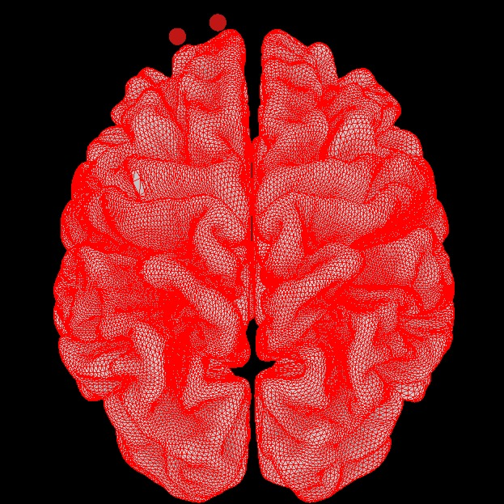

### Hi there 👋

<!---  -->

**Welcome to my GitHub page!**

# Aland Astudillo
## Data Scientist / Machine Learning Engineer / Research Engineer /
## 🐍 Python Developer 🐍

* [Portfolio Website](https://alandastudillo.github.io/AlandPortfolio/)
* [CV / Resume](https://github.com/alandastudillo/alandastudillo.github.io/blob/main/files/CV_short_engAA20220827_AUS_DEV.pdf) 
* [LinkedIn](https://www.linkedin.com/in/aland-astudillo/)
* [More about me](https://braindynamicslab.org/aland-astudillo/) 

Connect with me on these platforms:

<a href="https://twitter.com/Alienzote1">&nbsp;&nbsp;&nbsp;&nbsp;
 
<a href="https://www.linkedin.com/in/aland-astudillo/"> &nbsp;&nbsp;&nbsp;&nbsp;

based on https://medium.com/@importdata example

<!--
<a href="https://www.youtube.com/">&nbsp;&nbsp;&nbsp;&nbsp;

<a href="https://medium.com/">&nbsp;&nbsp;&nbsp;&nbsp;
<a href="https://www.kaggle.com/">

**alandastudillo/alandastudillo** is a ✨ _special_ ✨ repository because its `README.md` (this file) appears on your GitHub profile.

Here are some ideas to get you started:

- 🔭 I’m currently working on ...
- 🌱 I’m currently learning ...
- 👯 I’m looking to collaborate on ...
- 🤔 I’m looking for help with ...
- 💬 Ask me about ...
- 📫 How to reach me: ...
- 😄 Pronouns: ...
- ⚡ Fun fact: ...
-->
